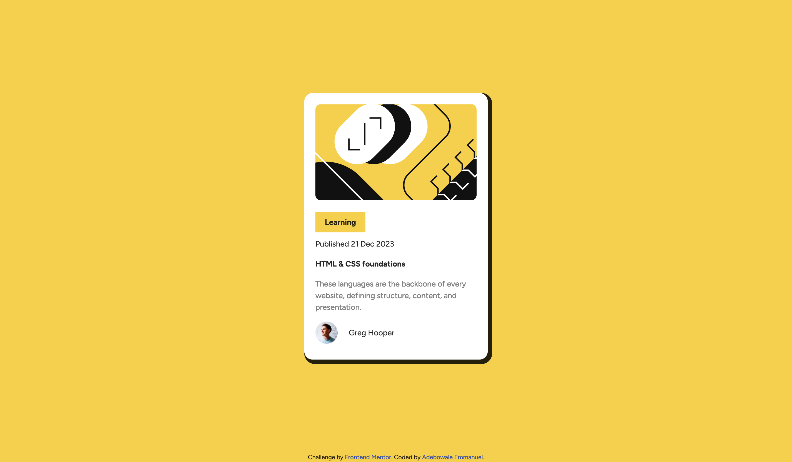

# Frontend Mentor - Blog preview card solution

This is a solution to the [Blog preview card challenge on Frontend Mentor](https://www.frontendmentor.io/challenges/blog-preview-card-ckPaj01IcS). Frontend Mentor challenges help you improve your coding skills by building realistic projects. 

## Technologies Used

- HTML
- CSS

## Preview

## How to Use

To view the blog preview card, simply open the `index.html` file in your web browser.

## Credits

- Challenge by [Frontend Mentor](https://www.frontendmentor.io)
- Coded by [Adebowale Emmanuel](https://www.linkedin.com/in/adebowaleemmanuel)

## Author

Adebowale Emmanuel